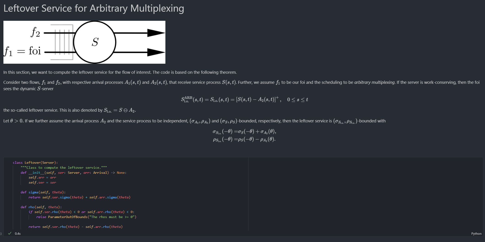

# Quick Start to Stochastic Network Calculus

### What is it?

The SNC Quick Start is a simple guide on how to implement the stochastic network calculus (SNC) with moment-generating functions (MGFs).
It is a Jupyter Notebook that combines the mathematical background with an actual implementation in Python 3.

The toolbox works well with [VS Code](https://code.visualstudio.com/) (together with the "Jupyter" and the "Markdown+Math" extension) or JetBrains [DataSpell](https://www.jetbrains.com/dataspell/).

## Screenshot in VS Code

